# 虚拟头节点


今天分享的内容是虚拟头结点在链表中的应用，题目有：
* LeetCode #83 删除排序列表中的重复元素
* LeetCode #82 删除排序列表中的重复元素||
* LeetCode #21 合并两个有序列表


## 01 LeetCode #83 删除排序列表中的重复元素

**题目描述：**

给定一个排序链表，删除所有重复的元素，使得每个元素只出现一次。

**示例:**

输入: 1->1->2
输出: 1->2

**思路分析：**

示例给出的链表示意图如下：

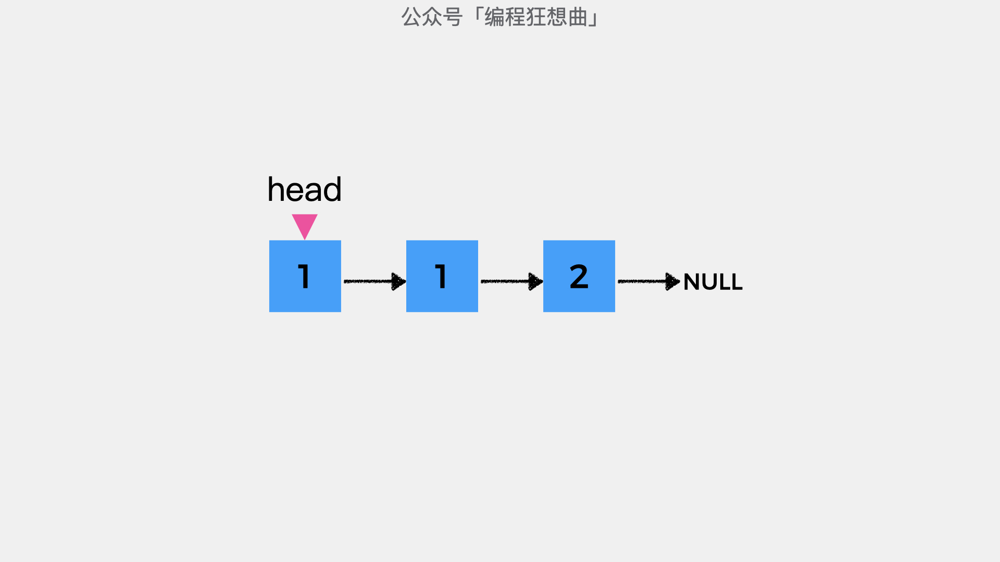


接着定义变量cur指向链表的头结点，表示当前考察的结点。

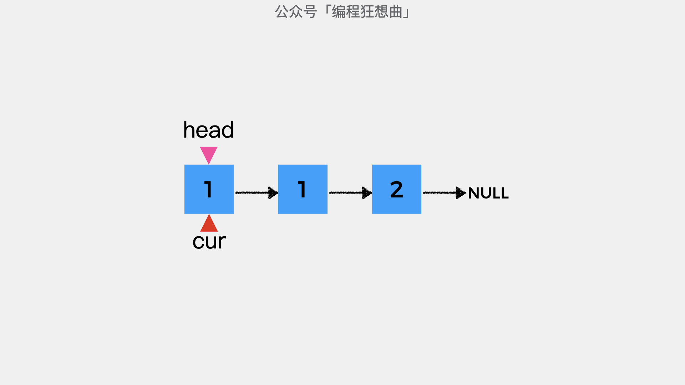


首先，看下cur指向的结点和其后一个结点的值是否相等，如果相等则表示其后一个结点需要删除。

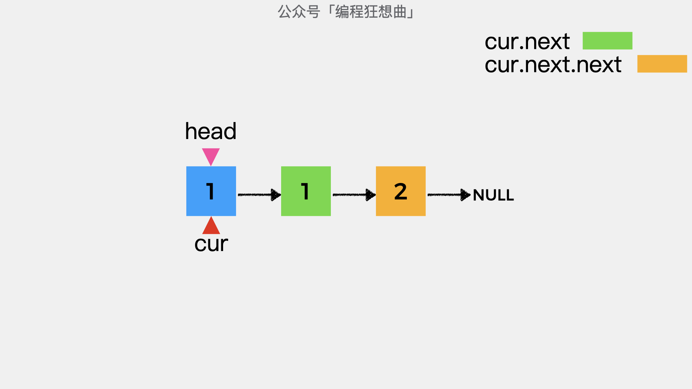


具体方法是将cur指向的结点的后继指针，指向其下一个结点的下一个结点。这样就将重复结点删除了。

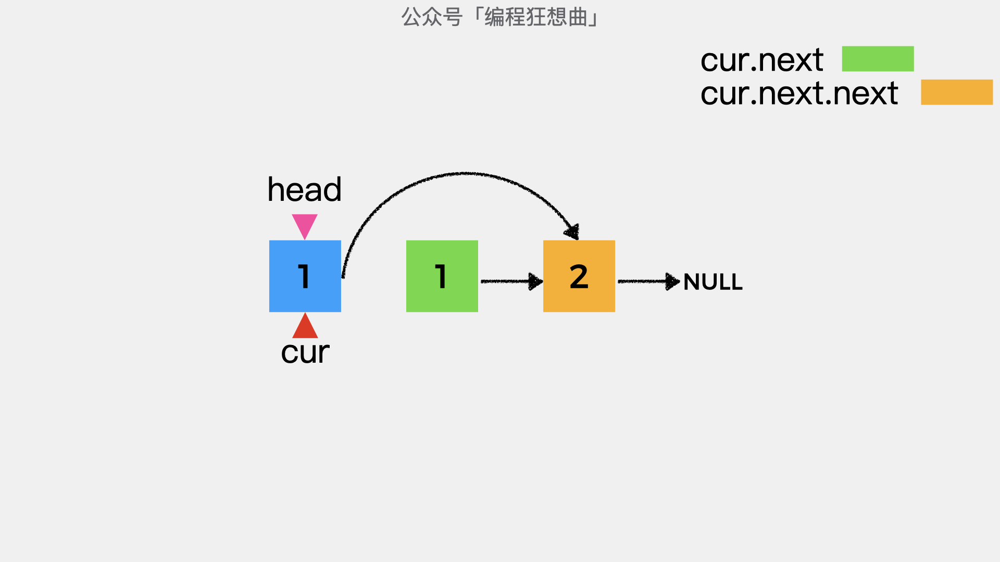


如下图，就是去除重复结点1之后，链表的结构。

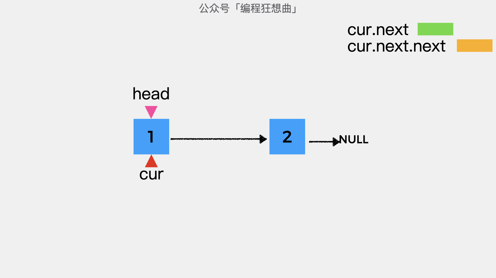


这时cur所指向的结点的下一个结点的值是2，与cur所指向的结点值不同。

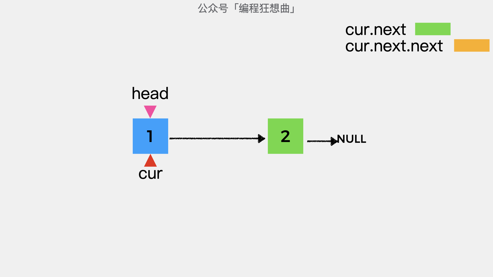


因此，不需要去重，这时将cur指向下一个结点，继续考察。这时，cur所指向的结点之后，没有其它结点，因此去重结束。

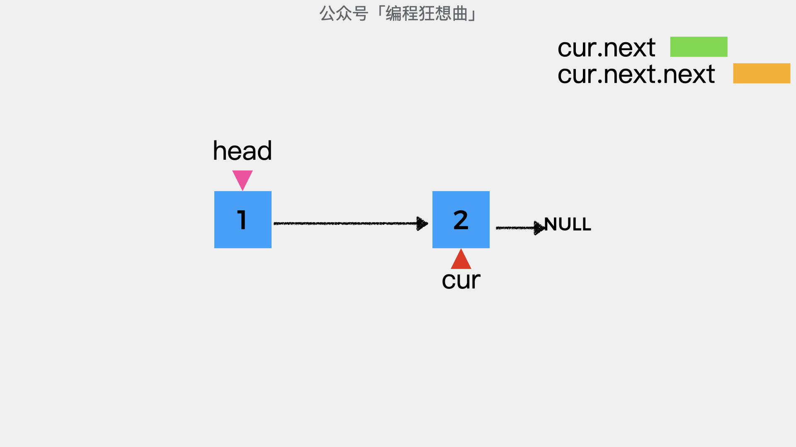


**动画演示：**

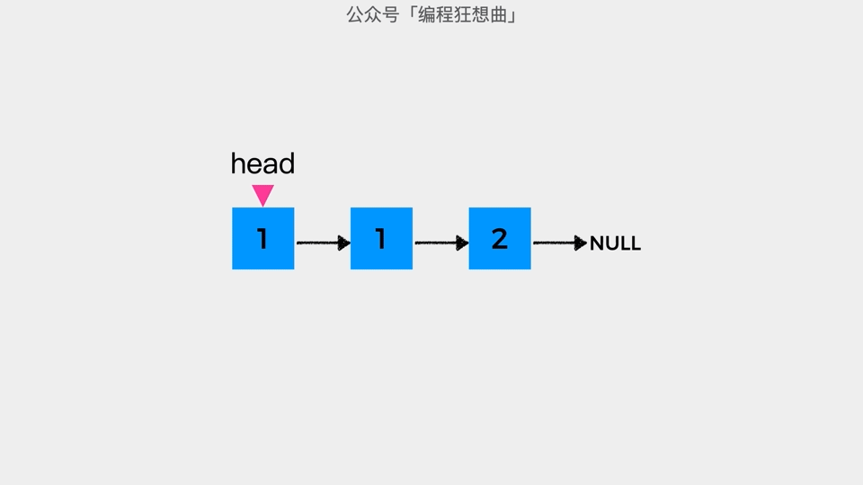


**代码实现：**
```java
public ListNode deleteDuplicates(ListNode head) {
    ListNode cur = head;
    // cur所指向的结点和其后一个结点都不为null时
    // 才可能有重复结点存在
    while (cur!=null && cur.next!=null) {
        if (cur.next.val == cur.val) {
            cur.next = cur.next.next;
        }else {
            cur = cur.next;
        }
    }
    return head;
}
```

## 02 LeetCode #82 删除排序列表中的重复元素||

**题目描述：**

给定一个排序链表，删除所有含有重复数字的节点，只保留原始链表中 没有重复出现 的数字。

**示例:**

输入: 1->1->1->2->3
输出: 2->3

**思路分析：**

该题目与题目#83的不同之处是，删除所有重复出现的元素。如示例所示，头结点是1，其后结点和其重复，因此也要删除。这时，用解决83题的思路就不合适了。
因此，需要一个虚拟头结点，然后用变量prev指向该虚拟头结点。这样在删除重复结点之后，剩余的结点就可以挂在prev之后继续考察了。具体步骤我们一起看下。
为了方便演示，我将示例给出的链表删减如下：

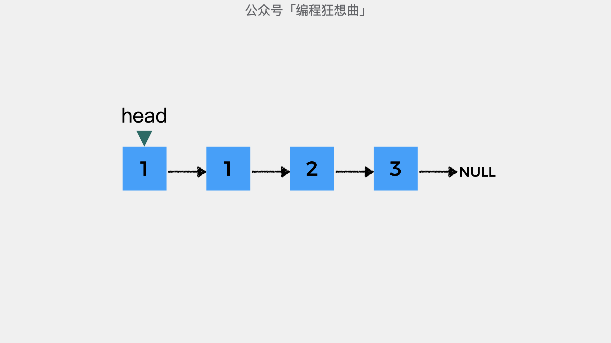


首先，增加虚拟头结点dummyHead，其后继指针指向头结点head。

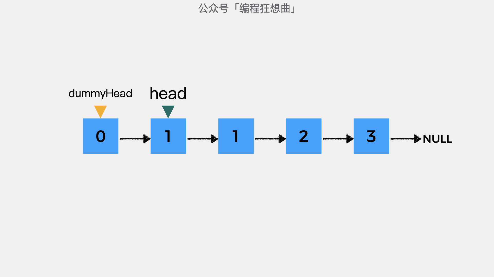


变量prev指向虚拟头结点dummyHead，用以将删除重复结点之后剩余的链表部分连接起来。

变量cur指向头结点head，表示当前考察的结点。

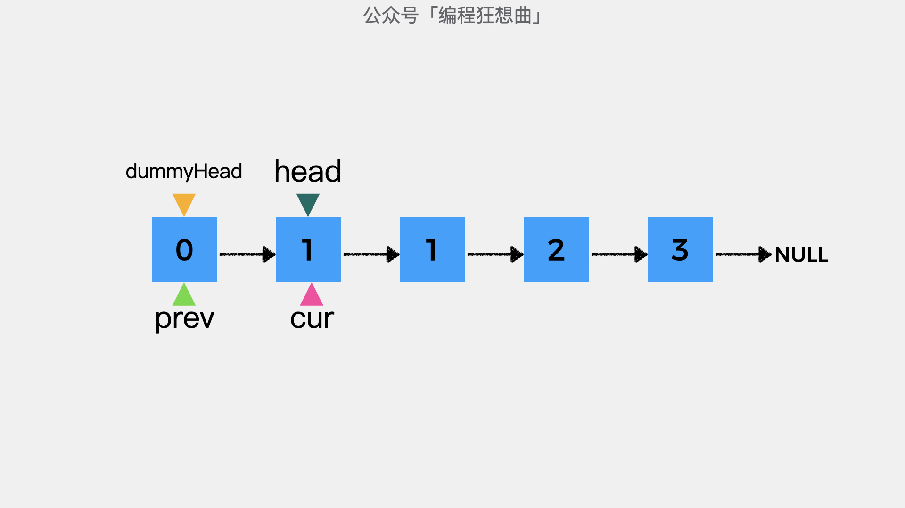


然后变量difNode指向cur所指向的结点，用以记录和当前考察结点不同的结点位置。

变量curRepeatNum表示和变量cur指向的结点重复的结点个数，初始值为0。


这时，变量cur和变量difNode指向的是同一个结点，因此curRepeatNum=1。

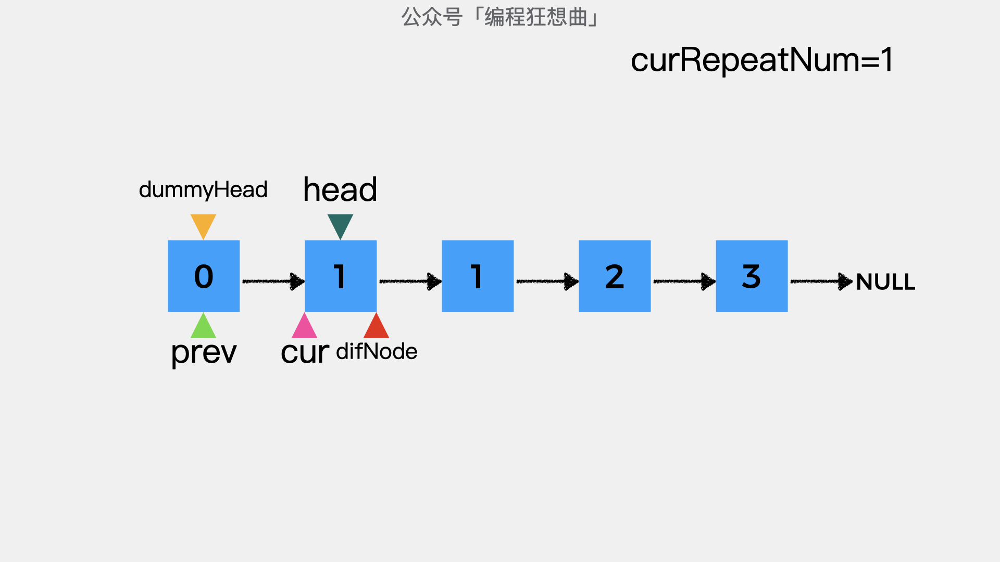


接着，将变量difNode向后移动一个位置，看下一个结点和变量cur指向的结点值是否相等。在这里，变量cur和变量difNode指向的结点值相等，因此curRepeatNum=2。

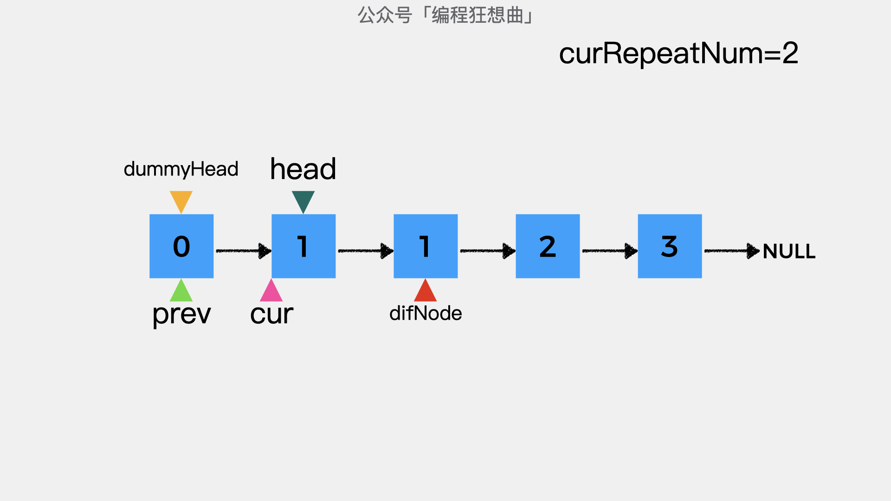


接着，将变量difNode继续向后移动一个位置，看下一个结点和变量cur指向的结点值是否相等。在这里，变量cur和变量difNode指向的结点值不相等。

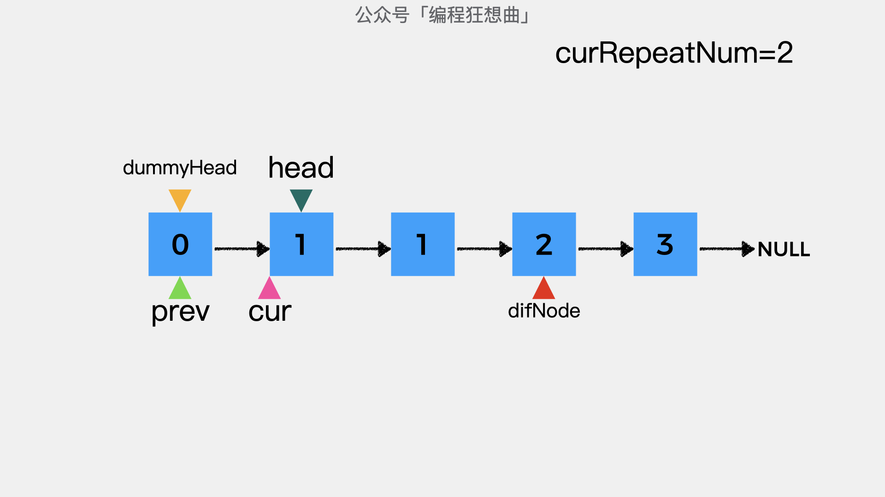


此时curRepeatNum=2，表示cur指向的结点1在链表中出现了2次。接着要做的是将变量prev指向的结点的后继指针指向变量difNode所指向的结点。这样，将就重复结点1从链表中删除了。

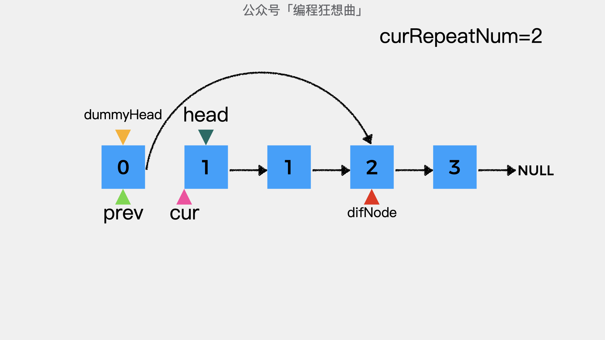


最后，要做的是将变量cur指向difNode所指向的结点，进行下一个结点的去重。

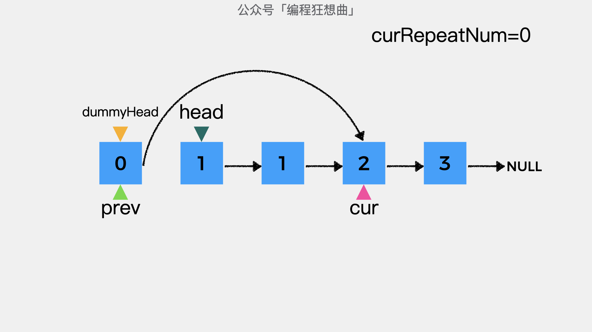


**动画演示：**


**代码实现：**

```java
public ListNode deleteDuplicates(ListNode head) {
    ListNode dummyHead = new ListNode(0);
    dummyHead.next = head;

    ListNode prev = dummyHead;
    ListNode cur = prev.next;
    while (cur != null) {
        int curRepeatNum = 0;
        ListNode difNode = cur;
        // 找到和cur指向的结点值不同的结点
        while (difNode != null && difNode.val == cur.val) {
            curRepeatNum++;
             difNode = difNode.next;
         }

        // 如果curRepeatNum的值大于1，则表示cur指向的结点重复出现了
        if (curRepeatNum > 1) {
             prev.next = difNode;
         }else {
            // cur指向的结点没有重复出现，则将变量prev指向cur所指向的结点
             prev = cur;
         }
         cur = difNode;
     }

     return dummyHead.next;
}
```

## 03 LeetCode #21 合并两个有序链表

**题目描述：**

将两个升序链表合并为一个新的 升序 链表并返回。新链表是通过拼接给定的两个链表的所有节点组成的。 

**示例:**


输入：l1 = [1,2,4], l2 = [1,3,4]
输出：[1,1,2,3,4,4]

**思路分析：**

新建虚拟头结点dummyHead，然后变量prev指向虚拟头结点。

接着，开始同时遍历链表l1和链表l2，直到其中一个为null。在遍历过程中，比较l1所指向的结点值和l2所指向的结点值：

* 如果l1指向的结点值小于等于l2指向的结点值，则将prev指向的结点的后继指针，指向l1指向的结点。然后l1向后移动一个位置，即指向其下一个结点；

* 如果l1指向的结点值大于l2指向的结点值，则将prev指向的结点的后继指针，指向l2指向的结点。然后l2向后移动一个位置，即指向其下一个结点；

最后，要么l1指向的结点不为空，要么l2指向的结点不为空，此时要做的就是将不为空的结点，挂在变量prev指向的结点之后。这时，虚拟头结点dummyHead之后的结点就是合并后的结果。

**动画演示：**


**代码实现：**

```java
public ListNode mergeTwoLists(ListNode l1, ListNode l2) {
    ListNode dummyHead = new ListNode(0);
    ListNode prev = dummyHead;
    while (l1 != null && l2 != null) {
        if (l1.val <= l2.val) {
            prev.next = l1;
            l1 = l1.next;
        }else {
            prev.next =l2;
            l2 = l2.next;
        }
        prev = prev.next;
    }

    if (l1 != null) {
        prev.next = l1;
    }

    if (l2 != null) {
        prev.next = l2;
    }
    return dummyHead.next;
}
```


**更多内容扫描下方二维码关注公众号「编程狂想曲」查看**,如有错误可在公众号加我个人微信后指出
<p align='center'>

</p>